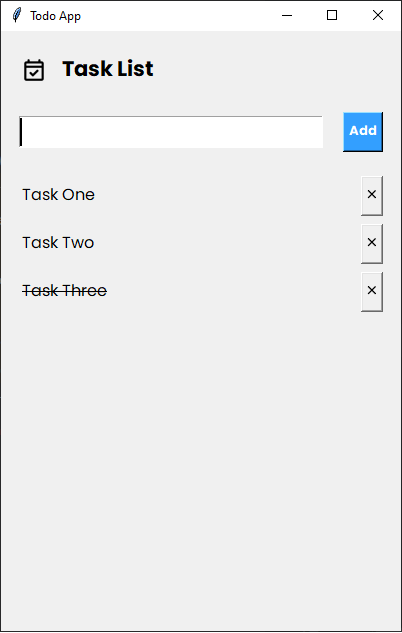

# Todo App

A simple GUI-based Todo List application built with Python and Tkinter. It allows users to add, mark as complete, and
delete tasks. The tasks persist across sessions using a text file.

## Features

- Add tasks to the list
- Mark tasks as completed (strikethrough effect)
- Delete tasks with a confirmation prompt
- Persist tasks using a `task.txt` file

## Screenshot

